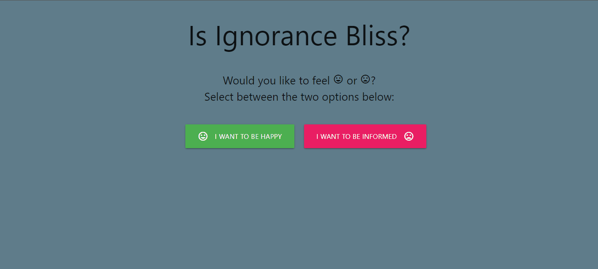
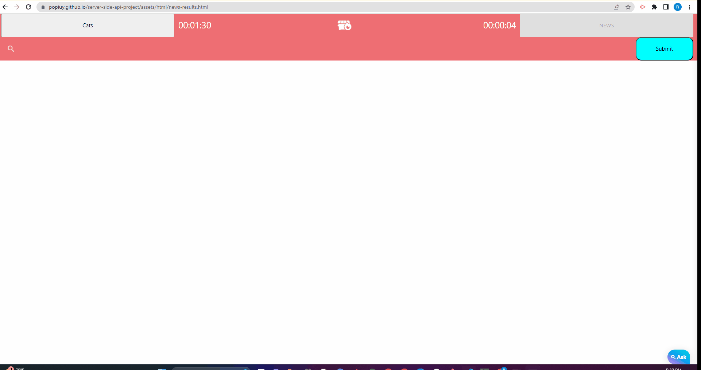
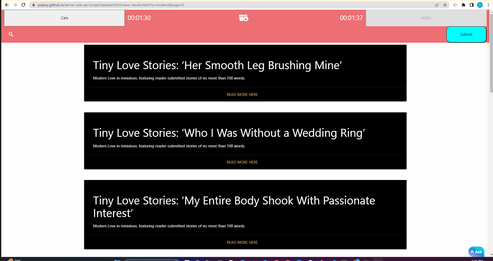

# Ignorance is Bliss: A Site About Doomscrolling

## Description

This is a simple site that will give you two very distinct forms of content - current news,
or pictures of cats.  

Our goal is to help people notice the effect that consuming content has on their mood and
wellbeing. Being an informed citizen is a stressful task in 2023, and we want to help people
find their balance. 

Disclaimer: Neither Derek, Ryan, or Theodore are medical experts. IiB is not intended to
diagnose, treat, or cure any disease. Talk to your doctor. 

## Usage

Visit https://popiuy.github.io/server-side-api-project/ and choose your path. 
You can switch paths any time with the buttons at the top of the screen.  

The webpage will track the amount of time you spend on news versus cats. After a while, 
take note of how you feel compared to the proportions of time you've spent on each page.  

(In-browser stat tracking will come in a future version)

## Technologies Used
- HTML
- CSS
- JavaScript
- Jquery - https://jquery.com/
- Materialize CSS - https://materializecss.com/
- Store.js  - https://github.com/marcuswestin/store.js/

## User Stories
    AS A User
    I WANT to be presented with a choice of two options 
    SO THAT I can make an intentional decision about what kind of content I want to consume. 

    AS A User
    I WANT to be able to see current news articles 
    SO THAT I may be more informed
    

    AS A User
    I WANT to be able to click through to see the full article
    SO THAT I can dig deeper into interesting topics

    AS A User
    I WANT to be able to see cat pictures
    SO THAT I can destress a bit

    AS A User
    I WANT to be able to change between each type of content with a single button press
    SO THAT I can adjust the content based on my current desire.

 

## CSS Framework
For this site, we used [Materialize](https://materializecss.com/grid.html). 
Made by Google, Materialize is similar to Bootstrap. It can be imported via CDN,
and then used by assigning predetermined classes to HTML tags.
It operates with a similar 12-columngrid system, and is 
inherently responsive to varying screen sizes:

## Learning Objectives
- Integrating third party APIs
- Creating responsive websites with CSS Frameworks (that aren't Bootstrap)
- Using client side storage to save site data
- Researching and integrating third party Javascript libraries

## Ackowledgements
- News API provided by The New York Times - https://developer.nytimes.com
- Picture API provided by The Art Institute of Chicago - http://api.artic.edu/docs/
- Materialize Icons via https://fonts.google.com/icons/
- Additional icons via https://fontawesome.com/

## Contact Us
- Derek Stanley-Howarth: [Github](https://github.com/DSHowarth)
- Theodore Okeke: [Github](https://github.com/TheoUO)
- Ryan Payne: [Github](https://github.com/Popiuy)
